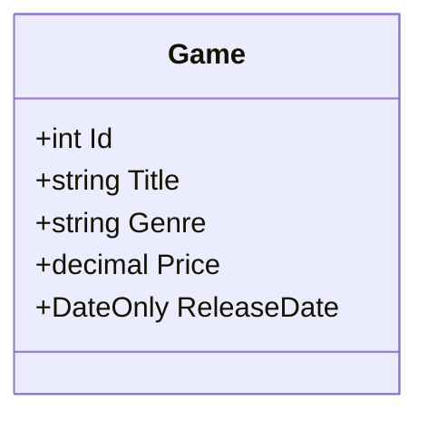

# Game Store API

## Architecture
### DTOs
For carrying data throughout the application, I chose to implement the GameDto as a record, along with the CreateGameDto and UpdateGameDto, as they are by default immutable and that simplifies the application by reducing the amount of boilerplate code to achieve the same level of integrity within the models.

The convention is to establish a new contract per operation, so I chose to follow this convention to have a separation of concerns and allow for future scalability in the case that an endpoint's requirements changes in the future.

## Endpoints
You can interact using CRUD operations and the server will respond with a status code and generally a JSON response body containing the resource state.

Using the listed endpoints, you are able to create, read, update and delete resources.

| Endpoint         | Role                         | Status         |
|------------------|------------------------------|----------------|
| `GET` /games     | Retrieve all games           | 200 Success    |
| `GET` /games/1   | Retrieve specific game by ID | 200 Success    |
| `POST` /games    | Create games as batch        | 201 Created    |
| `PUT` /games/1   | Update specific game by ID   | 201 Created    |
| `DELETE` games/1 | Delete specific game by ID   | 204 No content |

In the event of an error, the status code will be returned alongside a response body detailing the cause and potentially a resolution.

Status codes are grouped and any error codes will appear in the following ranges:

- Client-side error (400-499)
- Server-side error (500-599)

## Resources & Responses
The resources served by this API are games, therefore this section will describe the structure of the game resource, which is our *DTO**, and the responses returned by the program.

**This refers to an object which carries data between processes or applications.; this encapsulates data in a standardised format for transfer across layers or applications.*

